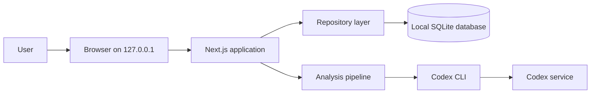
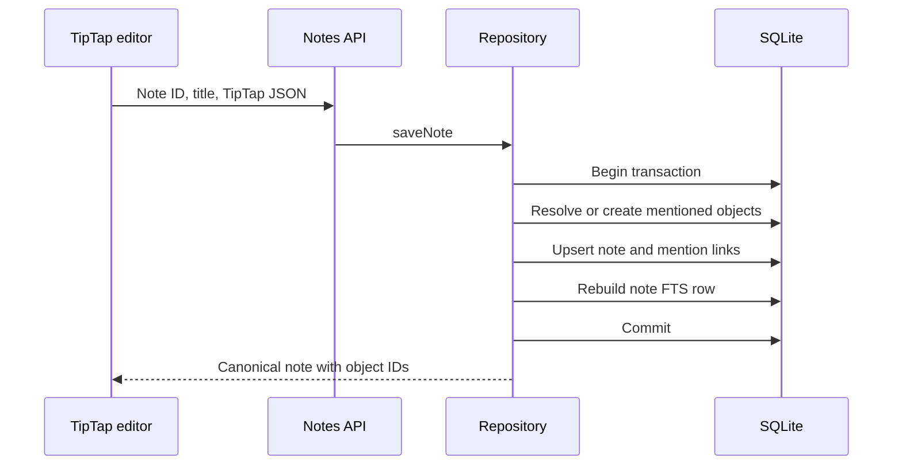
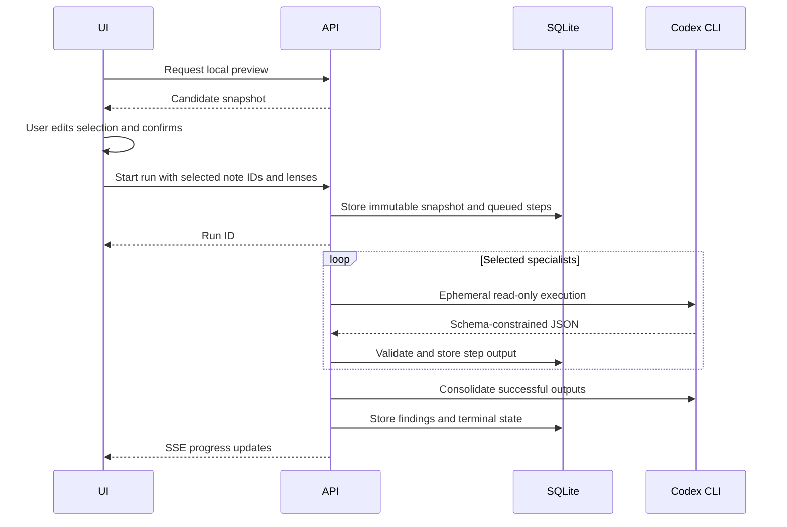

# Architecture

## Goals

Staff Chief is optimized for a single user, local persistence, explicit control over AI data sharing, and a small operational footprint. The architecture intentionally avoids authentication, hosted infrastructure, background jobs, and synchronization.

## System context

The Codex service is the only intentional runtime boundary outside the workstation, and it is reached only after the user confirms an analysis snapshot.

## Runtime components

### Next.js application

The App Router serves both the React interface and local API routes. The home page is dynamically rendered from the current application state. Interactive workspace components run on the client and refresh state through same-origin API requests.

The process listens on `127.0.0.1:3000`. `src/proxy.ts` validates the `Host` header for all matched requests and validates the `Origin` header for non-read-only methods.

### User interface

`StaffChiefApp` coordinates the three-column shell and view state. Major UI modules are:

- `RichNoteEditor`: TipTap editor, manual save state, and structured mention suggestions;
- `KnowledgeMap`: client-only 2D force graph;
- `AnalysisLauncherDialog`: scope and specialist selection;
- `AnalysisDialog`: snapshot preview, SSE progress, cancellation, retries, findings, and source navigation.

The graph is dynamically imported because its canvas implementation is browser-only.

### Repository and database

`src/lib/db/repository.ts` is the application data boundary. It owns transactions, record mapping, snapshot construction, graph derivation, archival, findings, and backup operations.

`better-sqlite3` provides synchronous local SQLite access. Drizzle definitions in `src/lib/db/schema.ts` document the typed schema, while initialization currently uses idempotent SQL in `src/lib/db/client.ts`.

The database uses WAL mode, foreign keys, and FTS5. The default path is `%LOCALAPPDATA%\StaffChief\staff-chief.db`; `STAFF_CHIEF_DATA_DIR` overrides the directory.

### Analysis provider

The internal `AnalysisProvider` contract isolates specialist execution from orchestration. The MVP implements `CodexCliProvider` only.

Each specialist receives:

- an immutable snapshot;
- its specialist name;
- prior specialist outputs only during consolidation;
- an `AbortSignal`.

The provider writes a temporary JSON Schema, starts `codex exec` in an empty temporary directory, sends context through standard input, validates the structured response with Zod, removes unsupported source IDs, and deletes the temporary directory.

### Analysis orchestration

The pipeline runs selected specialists sequentially and then runs consolidation. It persists step status after each transition and streams the aggregate run state to the browser through Server-Sent Events.

A specialist failure does not prevent later specialists from running. Consolidation failure falls back to deterministic title/category deduplication of successful outputs. The resulting run is marked partial when one or more steps fail.

## Main request flows

### Save a note with mentions

Object creation and mention persistence are atomic. Canonical object IDs replace temporary editor IDs before the note is returned.

### Run an analysis

## Design invariants

- No analysis starts without an explicit final confirmation.
- Saving a note is the only operation that commits temporary mention objects.
- Object identity is ID-based; names are mutable display data.
- Derived graph edges never become confirmed relationships automatically.
- Findings require at least one source ID from the submitted snapshot.
- Analysis snapshots are immutable after run creation.
- Archive operations are soft deletes.
- Restore creates a safety copy before replacing table contents.
- Runtime network access is not required for core knowledge management; Codex analysis is the exception.

## Known constraints

- The startup helper targets PowerShell on Windows.
- There is no database migration framework yet; initialization is idempotent but schema changes require deliberate compatibility work.
- The application is not designed for concurrent users or multiple running instances.
- The process-level cancellation registry is in memory; restarting the server loses active process handles, while persisted run history remains.
- There is no application-level encryption at rest.
