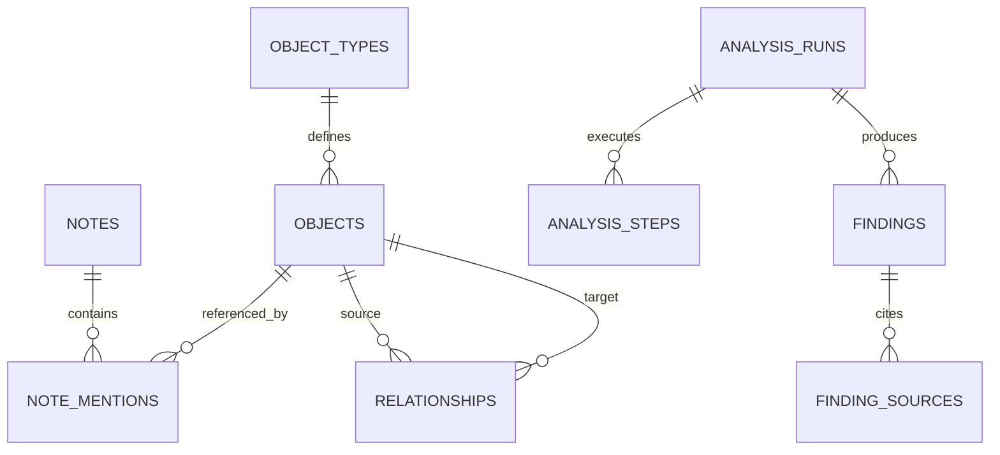

# Data model

Staff Chief stores its primary state in SQLite. Timestamps are ISO 8601 strings, identifiers are opaque text IDs, and user-deletable records use `archived_at` for soft deletion.

## Tables

| Table             | Purpose                                                          | Important constraints                                        |
| ----------------- | ---------------------------------------------------------------- | ------------------------------------------------------------ |
| `object_types`    | Visual and semantic definitions for object categories            | Normalized type name is globally unique                      |
| `objects`         | Typed entities such as a person, project, idea, or custom object | Normalized name is unique within a type                      |
| `notes`           | TipTap JSON, extracted search text, optional title, timestamps   | Archived notes remain stored                                 |
| `note_mentions`   | Structured many-to-many links from notes to objects              | Unique note/object pair; note deletion cascades              |
| `relationships`   | Explicit labeled object-to-object relationships                  | Origin is `manual` or `analysis`                             |
| `analysis_runs`   | Provider, scope, immutable snapshot, status, and errors          | Snapshot is stored as JSON at creation time                  |
| `analysis_steps`  | Ordered specialist and consolidation state                       | Belongs to a run; stores structured output JSON              |
| `findings`        | Evidence-linked analysis conclusions                             | Category, priority, confidence, action, and lifecycle status |
| `finding_sources` | Note and object references supporting a finding                  | Unique source per finding; finding deletion cascades         |
| `notes_fts`       | FTS5 index for note title and extracted text                     | Rebuilt after restore; not included in exports               |

## Entity relationships



`finding_sources.source_id` is intentionally polymorphic and is interpreted with `source_type` (`note` or `object`).

## Name normalization

Type and object names are trimmed, normalized with Unicode NFKD, stripped of combining diacritics, and lowercased with the `pt-BR` locale.

Examples that normalize to the same value:

- `Leonardo`
- `LEONARDO`
- `Léonardo`

Object uniqueness is scoped to `type_id`, so the same display name may exist in different types.

## Note representation

Each note stores:

- `content_json`: the canonical TipTap document;
- `content_text`: extracted plain text used for previews, analysis, and search;
- structured mention nodes containing canonical object IDs.

When a note is saved, the repository resolves every mention, creates missing objects when needed, rewrites temporary mention IDs, replaces the note's mention links, and refreshes its FTS row in one transaction.

## Graph derivation

The graph is a projection, not a separate persistence model:

- object nodes come from active `objects`;
- co-occurrence edges are calculated from active notes that mention both objects;
- confirmed edges come from active `relationships`;
- suggestion edges come from open connection findings with at least two object sources;
- note nodes and mention edges are added by the UI only when the note layer is enabled.

Accepting a supported connection finding inserts a relationship with `origin = 'analysis'`, links it to the finding, and marks the finding resolved.

## Analysis lifecycle

Run states are `queued`, `running`, `completed`, `partial`, `failed`, or `cancelled`.

Step states are `queued`, `running`, `completed`, `failed`, or `cancelled`. A run contains only the specialists selected by the user plus a final `consolidation` step.

Finding states are:

- `open`: actionable and visible in priorities;
- `resolved`: handled or accepted;
- `dismissed`: retained but intentionally ignored.

## Archival

Notes, objects, relationships, and object types have archival fields. The current UI archives notes, objects, and types instead of deleting them permanently. Active queries omit archived records, while JSON exports include them for historical integrity.

## Backup format

Version 1 exports the nine primary tables under a top-level object:

```json
{
  "version": 1,
  "exportedAt": "2026-09-04T00:00:00.000Z",
  "tables": {
    "object_types": [],
    "objects": [],
    "notes": [],
    "note_mentions": [],
    "relationships": [],
    "analysis_runs": [],
    "analysis_steps": [],
    "findings": [],
    "finding_sources": []
  }
}
```

The FTS table is rebuilt from `notes` after restore.
